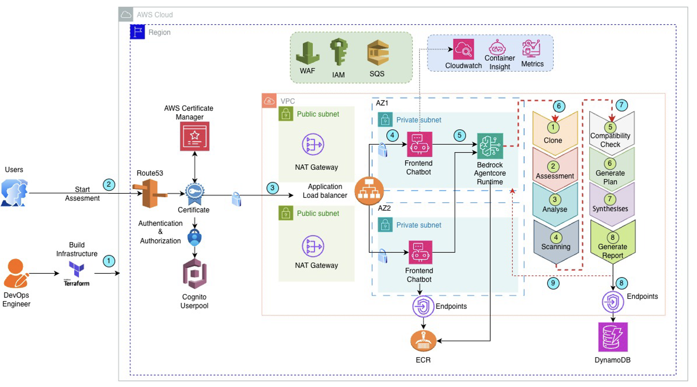
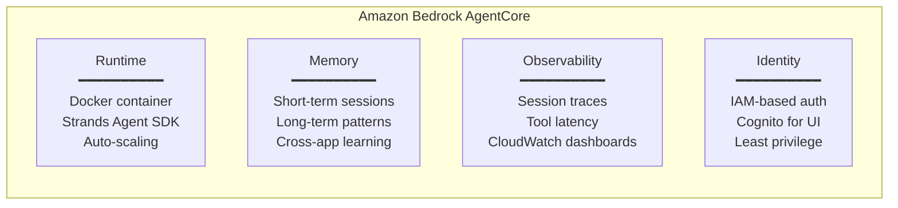

## AI-Powered EKS Migration Assessment with Bedrock AgentCore

An AI-powered migration assessment agent using Amazon Bedrock AgentCore that automatically analyzes application source code and container artifacts, identifies Amazon EKS migration blockers, and generates scored readiness reports with actionable migration plans.

## Agent Framework

This project uses **[Strands Agents](https://github.com/strands-agents/sdk-python)** — the native Python SDK for Amazon Bedrock AgentCore. Strands is purpose-built for AgentCore and provides:

- `@tool` decorator for defining tools with automatic schema generation
- `Agent` class that orchestrates multi-step tool calling with Claude
- `BedrockModel` for native Bedrock integration
- Automatic tool result handling and conversation management

The agent is deployed as a **Docker container** to AgentCore Runtime. Images are built in AWS via CodeBuild (ARM64) - no local Docker needed.

## Architeture Diagram 
 
 

## Architecture Workflow

```mermaid
graph TD
    A[User Access<br/>Browser opens ALB URL<br/>WAF filters request] --> B{Authentication}
    
    B -->|enable_cognito_auth = true| C[Cognito Login<br/>Email and Password<br/>USER_PASSWORD_AUTH flow]
    B -->|enable_cognito_auth = false| D[Direct Access<br/>IP restriction via SG<br/>WAF protection only]
    
    C --> E[Streamlit UI<br/>ECS Fargate<br/>Chat Interface]
    D --> E
    
    E --> F{Input Method}
    
    F -->|File Upload| G[Upload Files<br/>Source code, Dockerfiles<br/>Configs, manifests<br/>Uploaded to S3]
    
    F -->|Git Public Repo| H[Public Repository<br/>URL plus Branch<br/>No token needed]
    
    F -->|Git Private Repo| I[Private Repository<br/>URL plus Branch<br/>PAT token - masked]
    
    G --> J[Invoke AgentCore<br/>IAM SigV4 auth<br/>Session ID for memory]
    H --> J
    I --> J
    
    J --> K[AgentCore Runtime<br/>Docker Container<br/>Strands Agent SDK<br/>6 In-Process Tools]
    
    K --> L[Tool 1: clone_repository<br/>Git clone with or without token<br/>Upload files to S3<br/>Only for Git URL option]
    
    L --> M[Tool 2: assess_current_state<br/>Secrets inventory<br/>Storage and volumes<br/>Networking and auth<br/>Compute resources]
    
    M --> N[Tool 3: analyze_source_code<br/>Hardcoded IPs<br/>IBM MQ, LDAP, SOAP<br/>OpenShift, Azure, WebSphere<br/>Cron jobs, NFS]
    
    N --> O[Tool 4: scan_dependencies<br/>Stateful components<br/>Database connections<br/>Platform libraries]
    
    O --> P[Tool 5: check_eks_compatibility<br/>Dockerfile best practices<br/>Security and networking<br/>Resource sizing]
    
    P --> Q[Tool 6: generate_migration_plan<br/>Readiness score 0-100<br/>Effort estimate<br/>Migration runbook<br/>Target architecture]
    
    Q --> R[Claude on Bedrock<br/>Extended thinking<br/>Synthesizes all findings<br/>Structured report]
    
    R --> S[Persist and Cleanup<br/>Report to DynamoDB<br/>Source files deleted from S3]
    
    S --> T[Report in UI<br/>Chat interface<br/>Follow-up questions<br/>Download HTML PDF MD]
    
    style B fill:#fff3e0
    style C fill:#e3f2fd
    style D fill:#e8f5e9
    style F fill:#fff9c4
    style G fill:#e8f5e9
    style H fill:#e8f5e9
    style I fill:#fce4ec
    style K fill:#e3f2fd
    style Q fill:#f3e5f5
    style R fill:#e8eaf6
    style S fill:#fff3e0
    style T fill:#e8f5e9
```



## 🔄 How the Solution Works

### **1. User Access & WAF Protection**
- **Browser Access**: User opens the ALB endpoint URL (no custom domain required)
- **WAF Filtering**: AWS WAF applies rate limiting (1000 req/5min), blocks XSS/SQLi attacks, filters known bad inputs
- **IP Restriction**: Security group limits access to configured CIDR blocks

### **2. Authentication (Optional)**
- **When `enable_cognito_auth = false`**: Direct access to UI — protected by WAF + IP restriction only
- **When `enable_cognito_auth = true`**: Streamlit shows login form → user enters email + password → app calls Cognito `InitiateAuth` API → JWT validated → session created
- **No HTTPS/custom domain required**: Auth happens at app level via Cognito SDK, not ALB listener

### **3. Application Input (Three Methods)**
- **File Upload**: User uploads source code, Dockerfiles, configs directly → stored in S3
- **Git Public Repo**: User provides URL + branch → agent clones repository → uploads to S3
- **Git Private Repo**: User provides URL + branch + PAT (masked) → agent clones with token → uploads to S3 → token never stored

### **4. Agent Invocation**
- **IAM/SigV4 Auth**: ECS task role signs the request to AgentCore — no API keys needed
- **Session Isolation**: Each assessment runs in its own AgentCore session
- **Memory Integration**: AgentCore Memory provides cross-session learning from past assessments

### **5. Assessment Pipeline (6 Tools)**
- **clone_repository**: Clones Git repo (if URL provided), uploads analyzable files to S3
- **assess_current_state**: Extracts complete infrastructure inventory — secrets, storage, networking, auth, compute, messaging, databases, cron jobs, certificates
- **analyze_source_code**: Scans for migration blockers — hardcoded IPs, IBM MQ, LDAP/SAML, SOAP, APIGEE, OpenShift/Azure/WebSphere patterns, NFS, cron jobs
- **scan_dependencies**: Identifies stateful components — Oracle, Redis, Kafka, Elasticsearch, platform-specific libraries
- **check_eks_compatibility**: Validates Dockerfiles, security (root user, privileged), networking (host mode), resource sizing, certificates
- **generate_migration_plan**: Aggregates findings, calculates readiness score (0-100), estimates effort, builds phased runbook, recommends target EKS architecture

### **6. LLM Synthesis (Claude on Bedrock)**
- **Extended Thinking**: Claude reasons over all tool outputs with multi-step analysis
- **Structured Report**: Produces comprehensive report with Current State → Findings → Target State → Runbook
- **Context-Aware**: Uses assessment data to provide specific recommendations (not generic)

### **7. Persist & Cleanup**
- **DynamoDB**: Full assessment report saved for history and portfolio tracking
- **S3 Cleanup**: Source files automatically deleted after report saved — no customer code persists
- **Security**: Sensitive application code never remains at rest in S3

### **8. Report Delivery & Follow-up**
- **Chat Interface**: Report displayed in Streamlit chat — user can ask follow-up questions
- **Fast Follow-ups**: Questions answered from report context without re-running tools (10-30 seconds)
- **Download**: Report available as HTML (print-to-PDF), Markdown
- **History**: Past assessments visible in sidebar from DynamoDB

## 📋 Assessment Report Structure

The agent produces a structured report with 8 sections:

| Section | Contents |
|---------|----------|
| **1. Executive Summary** | Readiness score (0-100), total issues by severity, files analyzed, total effort estimate |
| **2. Current State Assessment** | Application profile, compute resources, secrets inventory, storage & volumes, networking, authentication, messaging, databases, upstream/downstream dependencies, scheduled tasks, monitoring |
| **3. Migration Blockers & Findings** | Each finding with severity, current state, why it's a problem for EKS, affected files |
| **4. Target State Recommendation** | For each component: current → EKS equivalent with K8s YAML snippets (Deployment, Ingress, ExternalSecret, CronJob, NetworkPolicy, IRSA ServiceAccount) |
| **5. Migration Effort & Timeline** | Phased effort breakdown with hours, days, and dependencies per phase |
| **6. Migration Runbook** | Step-by-step tasks organized by phase (Remediate → Containerize → K8s Manifests → Deploy & Validate) |
| **7. Risk Assessment** | Risks with impact, probability, and mitigation strategies |
| **8. Target Architecture** | Text-based architecture diagram showing EKS cluster, managed services, hybrid connectivity, observability stack |

**Key design decisions:**
- Tools run **in-process** inside the Strands agent — no Lambda or Gateway overhead.
- AgentCore Memory provides cross-session learning (patterns from past assessments improve future ones).
- The ALB provides a public DNS endpoint for testing — no custom domain needed.
- Cognito protects the UI; AgentCore uses IAM auth (separate concerns).

## Deployment Model

| Component | Deployment Method | Why |
|-----------|------------------|-----|
| Agent (Strands) | Docker/ECR via CodeBuild → AgentCore Runtime | Tools run in-process, no Lambda needed |
| Memory | AgentCore Memory | Managed short-term + long-term memory |
| UI (Streamlit) | Docker/ECR via CodeBuild → ECS Fargate | Persistent process for Streamlit |
| Infrastructure | Terraform modules | Reusable, version-controlled |

**Why no Lambda/Gateway?** — Strands Agents SDK runs tools **in-process** inside the agent. The `@tool` decorated functions execute directly when the LLM calls them. There's no need for a separate Lambda function or AgentCore Gateway — that would add latency and complexity for no benefit.

**Why CodeBuild?** — Docker images are built in AWS (ARM64 for AgentCore). No local Docker installation needed on the developer's machine.

## Testing Without a Custom Domain

You do **not** need a DNS endpoint or custom domain to test this. The deployment gives you:

1. **ALB DNS name** — The Application Load Balancer provides a public URL like:
   ```
   http://eks-migration-agent-ui-alb-123456789.us-east-1.elb.amazonaws.com
   ```
   This is accessible from any browser immediately after deployment.

2. **Direct CLI invocation** — You can also invoke the agent directly without the UI:
   ```bash
   python scripts/invoke_agent.py --runtime-id <id> --app-name my-app --s3-prefix assessments/my-app/
   ```

3. **Security** — Restrict access using the `allowed_cidr_blocks` variable in `terraform.tfvars`:
   ```hcl
   # Restrict to your IP only
   allowed_cidr_blocks = ["YOUR_IP/32"]
   ```

## AgentCore Capabilities Used



## Authentication & Authorization

Three security layers protect the solution:

| Layer | Mechanism | How |
|-------|-----------|-----|
| WAF (always on) | **AWS WAF** | Rate limiting (1000 req/5min), AWS Managed Rules (XSS, SQLi, bad inputs) |
| UI access (optional) | **Cognito User Pool** | When `enable_cognito_auth = true` + ACM cert: ALB validates Cognito JWT on every request. Users log in via Cognito hosted UI (OAuth2 code flow). |
| Agent invocation | **IAM / SigV4** | ECS task role has `bedrock-agentcore:InvokeAgentRuntime` permission. The AWS SDK signs requests automatically. No Cognito token needed. |
| Tool execution | **In-process** | Tools run inside the Strands agent — no separate IAM needed. They inherit the AgentCore execution role for S3/DynamoDB access. |

```
Browser → WAF → ALB → [Optional: Cognito JWT check] → ECS Fargate (Streamlit)
                                                            ↓ IAM SigV4
                                                      AgentCore Endpoint
                                                            ↓
                                                      AgentCore Runtime (Strands Agent)
                                                            ↓ in-process
                                                      @tool functions (S3, DynamoDB)
```

To enable Cognito authentication (requires custom domain + HTTPS):
```hcl
# terraform.tfvars
enable_cognito_auth = true
acm_certificate_arn = "arn:aws:acm:us-east-1:ACCOUNT:certificate/CERT-ID"
```

## Prerequisites

- AWS Account with Amazon Bedrock model access (Claude) enabled
- [Terraform](https://www.terraform.io/downloads) >= 1.5.0
- [AWS CLI v2](https://docs.aws.amazon.com/cli/latest/userguide/getting-started-install.html)
- [Docker](https://docs.docker.com/get-docker/) (only needed for local testing, not for deployment)
- Python 3.11+

## Project Structure

```
├── terraform/
│   ├── modules/                    # Reusable modules (one per resource type)
│   │   ├── networking/             # VPC, subnets, IGW, NAT, security groups
│   │   │   ├── main.tf
│   │   │   ├── variables.tf
│   │   │   └── outputs.tf
│   │   ├── storage/                # S3 (artifacts + agent code), DynamoDB
│   │   │   ├── main.tf
│   │   │   ├── variables.tf
│   │   │   └── outputs.tf
│   │   ├── ecr/                    # ECR repository for UI image
│   │   │   ├── main.tf
│   │   │   ├── variables.tf
│   │   │   └── outputs.tf
│   │   ├── iam/                    # All IAM roles and policies (separate files)
│   │   │   ├── agentcore_role.tf   # AgentCore execution role + policies
│   │   │   ├── ecs_role.tf         # ECS task execution + task roles
│   │   │   ├── variables.tf
│   │   │   └── outputs.tf
│   │   ├── cognito/                # Cognito User Pool + App Client (UI auth)
│   │   │   ├── main.tf
│   │   │   ├── variables.tf
│   │   │   └── outputs.tf
│   │   ├── agentcore_runtime/      # AgentCore Runtime (Docker/ECR)
│   │   │   ├── main.tf
│   │   │   ├── variables.tf
│   │   │   └── outputs.tf
│   │   ├── agentcore_endpoint/     # AgentCore Runtime Endpoint (invoke URL)
│   │   │   ├── main.tf
│   │   │   ├── variables.tf
│   │   │   └── outputs.tf
│   │   ├── agentcore_memory/       # AgentCore Memory (short + long term)
│   │   │   ├── main.tf
│   │   │   ├── variables.tf
│   │   │   └── outputs.tf
│   │   └── ecs_ui/                 # ECS Fargate + ALB + Cognito auth
│   │       ├── main.tf
│   │       ├── variables.tf
│   │       └── outputs.tf
│   └── examples/
│       └── production/             # Root module — wires all modules together
│           ├── main.tf
│           ├── provider.tf
│           ├── variables.tf
│           ├── outputs.tf
│           └── terraform.tfvars
├── src/
│   └── agent/                      # Strands Agent (deployed as Docker/ECR)
│       ├── agent_server.py
│       ├── Dockerfile
│       ├── requirements.txt
│       └── tools/
│           ├── clone_repository.py         # Git clone + S3 upload
│           ├── assess_current_state.py     # Infrastructure inventory extraction
│           ├── analyze_source_code.py      # Code analysis (all platforms)
│           ├── scan_dependencies.py        # Dependency & stateful component scan
│           ├── check_eks_compatibility.py  # Container & EKS best practices
│           └── generate_migration_plan.py  # Scored report + runbook
├── src/ui/                         # Streamlit UI (ECS Fargate)
│   ├── Dockerfile
│   ├── app.py                      # Chat interface + file upload + Git URL
│   └── requirements.txt
├── scripts/
│   ├── deploy.sh                   # One-command deployment
│   ├── invoke_agent.py             # CLI agent invocation
│   ├── cleanup.sh                 # Destroy all + clean local files
│                   
└── README.md
```

## Quick Start

### 1. Clone & Configure

```bash
# Clone the repository
git clone https://github.com/aws-samples/sample-AI-Powered-EKS-Migration-Assessment.git
cd sample-AI-Powered-EKS-Migration-Assessment

# Edit the Terraform configuration
vi terraform/examples/production/terraform.tfvars
```

Update `terraform/examples/production/terraform.tfvars` with your values:

```hcl
aws_region               = "us-east-1"
environment              = "dev"
project_name             = "eks-migration-agent"    # lowercase, hyphens only, no spaces
bedrock_model_id         = "us.anthropic.claude-sonnet-4-20250514-v1:0"
allowed_cidr_blocks      = ["YOUR_IP/32"]           # Replace with your IP from above
allowed_ipv6_cidr_blocks = []                       # Add your IPv6 if needed
enable_cognito_auth      = true                     # Set false for quick testing without login
```

> **Important:** `project_name` must be lowercase alphanumeric and hyphens only (e.g. `eks-migration-agent`). Spaces, uppercase, or special characters will cause deployment failure.

### 2. Deploy

```bash
# Move to scripts folder and run deploy (~10-15 minutes)
cd scripts
chmod +x deploy.sh cleanup.sh
./deploy.sh
```

Terraform root is at `terraform/examples/production/`. The deploy script:
1. Packages agent and UI source code as zip files
2. Runs `terraform init + plan + apply` from `terraform/examples/production/`
3. CodeBuild builds ARM64 Docker images in AWS and pushes to ECR
4. AgentCore Runtime is created with the agent container image

**Resources deployed by Terraform:**

| Category | Resources |
|----------|-----------|
| **Networking** | VPC, 2 public subnets (IPv6), 2 private subnets, Internet Gateway, NAT Gateway, route tables, ALB security group, ECS security group |
| **Compute** | ECS Fargate cluster, task definition (ARM64), service (2 replicas), Application Load Balancer (dualstack) |
| **AgentCore** | Agent Runtime (Docker/ECR), Runtime Endpoint, Memory |
| **Build** | 2 CodeBuild projects (agent + UI), IAM role for CodeBuild |
| **Storage** | S3 bucket (artifacts), DynamoDB table (assessments) |
| **Container Registry** | 2 ECR repositories (agent + UI) |
| **Security** | AWS WAF (rate limiting, managed rules), KMS CMK (encryption at rest), IAM roles (AgentCore, ECS task, ECS execution), least-privilege policies, Optional Cognito User Pool |
| **Monitoring** | CloudWatch log groups (ECS, CodeBuild) |

### 3. Access the UI

After deployment, the script outputs the ALB URL:

```
http://eks-migration-agent-ui-alb-XXXXXXXXX.us-east-1.elb.amazonaws.com
```

Open this in your browser. No DNS setup needed.

### 4. Assess an Application

**Method A: File Upload (via UI)**
1. Open the ALB URL in your browser
2. Login (if Cognito enabled)
3. Enter your application name and select type
4. Upload source code, Dockerfiles, configs, manifests
5. Click **Run Assessment**
6. View the scored readiness report
7. Ask follow-up questions in the chat

**Method B: Git Repository URL (via UI)**
1. Click the **Git Repository URL** tab
2. Enter repository URL: `https://github.com/your-org/your-app.git`
3. Enter branch name (default: `main`)
4. For private repos: enter Personal Access Token (PAT) with `repo` read permission
5. Click **Run Assessment**

**Method C: Direct S3 + CLI**
```bash
# Upload your application artifacts
aws s3 cp ./your-app/ s3://<bucket>/assessments/your-app/ --recursive

# Run assessment
python scripts/invoke_agent.py \
  --runtime-id <agent-runtime-id> \
  --app-name "my-spring-boot-app" \
  --s3-prefix "assessments/your-app/"
```

### 5. Review Results

The agent produces a structured report:

```
=== EKS Migration Readiness Assessment ===
Application: my-spring-boot-app
Overall Readiness Score: 62/100
Category: CONDITIONALLY READY (requires remediation)

HIGH (Blockers):
  • Local filesystem dependency → Use Amazon EFS/S3 (8h)
  • Redis session as local sidecar → Use ElastiCache (4h)

MEDIUM (Warnings):
  • Hardcoded DB connection string → Use K8s Secrets (2h)
  • No health check endpoints → Add Actuator /health (2h)

Recommended EKS Architecture:
  • 3 replicas, rolling update
  • Amazon EFS via CSI driver
  • ElastiCache for Redis (cluster mode)
  • AWS Load Balancer Controller (ALB)
  • External Secrets Operator

Total Remediation: 17h | Total with EKS Setup: 32h
```

## Security Scanning

Run security scans before deploying or submitting for AWS security review:

```bash
chmod +x scripts/security_scan.sh
./scripts/security_scan.sh
```

This runs:

| Tool | What it scans | Install |
|------|--------------|---------|
| **Checkov** | Terraform IaC misconfigurations (S3 encryption, IAM policies, SG rules) | `pip install checkov` |
| **tfsec** | Terraform static analysis (HIGH/CRITICAL severity) | `brew install tfsec` |
| **Bandit** | Python code security (injection, hardcoded passwords, unsafe functions) | `pip install bandit` |
| **Safety** | Python dependency CVEs | `pip install safety` |
| **detect-secrets** | Hardcoded secrets/tokens in source | `pip install detect-secrets` |

For CI/CD, use pre-commit hooks:

```bash
pip install pre-commit
pre-commit install
pre-commit run --all-files
```

Configuration files: `.checkov.yaml`, `.bandit.yaml`, `.pre-commit-config.yaml`

## Cleanup

After testing, run the cleanup script to destroy all deployed AWS resources and remove local Terraform files:

```bash
chmod +x scripts/cleanup.sh
./scripts/cleanup.sh
```

The cleanup script performs the following:

| Step | Action |
|------|--------|
| 1 | Empties the S3 artifacts bucket |
| 2 | Empties the S3 agent code bucket |
| 3 | Deletes all ECR images (agent + UI repositories) |
| 4 | Runs `terraform destroy -auto-approve` to tear down all infrastructure |
| 5 | Removes local build artifacts and Terraform state files |

After cleanup, your local workspace is back to a clean state with no leftover state or lock files.

## Cost Estimate

**Per Assessment Cost:**

| Component | Per Assessment |
|-----------|---------------|
| Amazon Bedrock (Claude) | $0.15-$0.50 |
| AgentCore Runtime | $0.02-$0.05 |
| S3 + DynamoDB | < $0.01 |
| **Total per assessment** | **$0.18-$0.57** |

**Monthly Infrastructure Cost (always-on):**

| Component | Monthly Cost |
|-----------|-------------|
| ECS Fargate (UI, 2 tasks) | ~$30 |
| Application Load Balancer | ~$20 |
| NAT Gateway | ~$35 |
| AWS WAF | ~$6 |
| CloudWatch Logs | ~$5 |
| **Total infrastructure** | **~$96/month** |

**vs. Manual Assessment:** 2–3 days / $2,000–$4,000 per app

## Supported Source Platforms

This solution assesses applications migrating from **any platform** to Amazon EKS:

| Source Platform | What's Detected |
|----------------|----------------|
| Red Hat OpenShift | Routes, DeploymentConfig, BuildConfig, ImageStream, SCC → EKS equivalents |
| Microsoft Azure (AKS/VMs) | Azure Pipelines, Service Bus, Azure SDK → AWS equivalents |
| On-premises (WebSphere/JBoss/WebLogic) | Platform configs, JNDI, WAR packaging → containerization |
| Self-managed Kubernetes | Existing manifests → EKS-specific annotations, StorageClass, IRSA |
| Docker Swarm | docker-compose, volumes, networking → K8s manifests |
| Google Cloud (GKE) | GCP-specific configs → AWS equivalents |
| Non-containerized (VMs/Bare-metal) | Full containerization assessment |

## What the Agent Assesses

| Category | Details |
|----------|--------|
| Source Code | Hardcoded IPs, filesystem writes, session state, platform-specific code |
| Secrets & Credentials | Inventory of all secrets, storage method, recommendations |
| Storage & Volumes | NFS, local paths, capacity, IOPS → EFS/EBS/S3 |
| Networking & Ingress | Ports, protocols, LB, DNS → ALB/Ingress/NetworkPolicy |
| Authentication | LDAP, SAML, OAuth, mTLS, certificates |
| Messaging | IBM MQ, Kafka, RabbitMQ, SOAP → Amazon MQ/MSK |
| Database & State | Oracle, PostgreSQL, Redis, Elasticsearch |
| Dependencies | Upstream/downstream services with migration phases |
| Scheduled Tasks | Cron jobs → Kubernetes CronJob |
| Resource Sizing | CPU, memory, JVM heap → K8s resource requests/limits, HPA |
| Observability | Current monitoring → CloudWatch/X-Ray/Fluent Bit |

## Private Git Repository Authentication

The Git URL feature supports both **public and private repositories**:

| Repository Type | What to provide | Token field |
|----------------|-----------------|-------------|
| Public | URL + Branch | Leave empty |
| Private | URL + Branch + PAT | Enter token (masked) |

**Creating a Personal Access Token (PAT):**

1. Go to GitHub → Settings → Developer Settings → Personal Access Tokens
2. Select **Classic** token
3. Permission: `repo` (read access to clone)
4. Generate and copy the token
5. Paste in the UI's "Access Token" field (masked input)

**Security:**
- Token is passed only for the clone operation — never stored in S3 or DynamoDB
- Source files are automatically deleted from S3 after assessment completes
- Token is transmitted via IAM/SigV4 encrypted channel to AgentCore

**For enterprise integration**, consider these alternatives:

| Method | Implementation | Security |
|--------|---------------|----------|
| GitHub App | Generate installation token via GitHub API | Auto-expires, fine-grained permissions |
| AWS CodeStar Connection | Use AWS-managed GitHub/GitLab connection | Best for AWS-native, no token management |
| SSH Key | Mount SSH key in agent container | Requires key rotation |

## Security

See [CONTRIBUTING](CONTRIBUTING.md#security-issue-notifications) for more information.

## License

This library is licensed under the MIT-0 License. See the LICENSE file.

